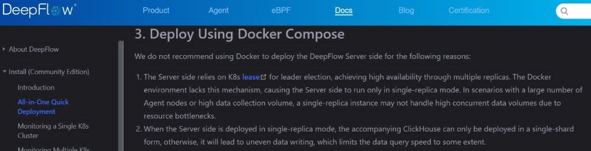
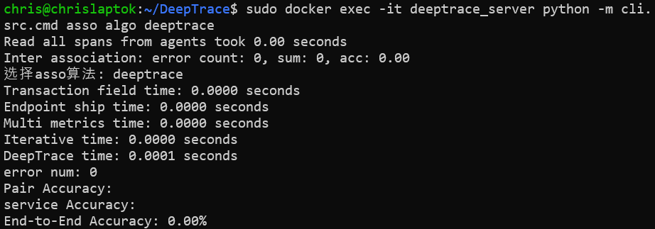
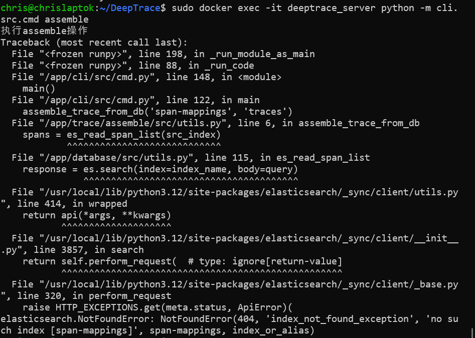
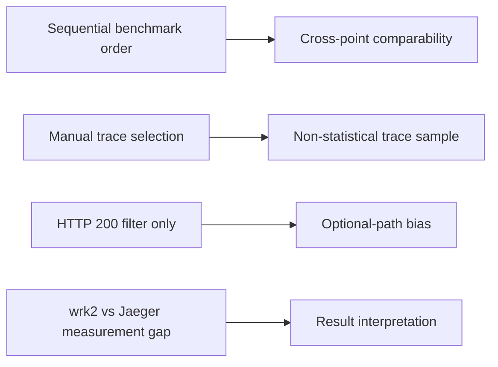

# Distributed Tracing Evaluation on DeathStarBench Social Network

**Course:** TIP, AGH University of Science and Technology  
**Author:** Kacper Bieniasz, Krystian Madej

**Status:** Jaeger instrumentation tracing baseline completed. DeepFlow and DeepTrace were evaluated as alternative approaches but could not be integrated in this environment. This report consolidates the full PoC evaluation into a single document.

---

## Abstract

This proof-of-concept evaluates whether modern distributed tracing methods are stable and practical enough to apply in a controlled benchmark environment. The benchmark application is DeathStarBench Social Network, exercised with wrk2 at four load points (two write workloads, two read workloads). Three tracing approaches were considered in sequence: DeepFlow (eBPF-based, zero instrumentation), DeepTrace (research-oriented zero instrumentation), and Jaeger (instrumentation-based baseline already present in DeathStarBench).

DeepFlow could not be deployed because the official documentation discourages Docker Compose for the server component and recommends Kubernetes for leader election and high availability. DeepTrace was deployed and extensively troubleshooted, but documentation–implementation gaps, required local patches, and failed span correlation prevented any usable traces from being collected. Jaeger produced the only complete dataset: wrk2 results and three manually exported traces per benchmark point, with full analysis.

The key finding is twofold: Jaeger is production-ready in this Docker Compose setup, exposing service topology and per-span latency reliably; and aggregate wrk2 latency under sustained load (often seconds) diverges sharply from individual Jaeger trace durations (milliseconds to low hundreds of milliseconds), reflecting queueing and contention not visible in a handful of hand-picked traces.

---

## 1. Introduction

### 1.1 Motivation

Microservice architectures distribute application logic across many independently deployable services. Understanding request flow, identifying bottlenecks, and diagnosing failures in such systems requires observability beyond per-service logs and metrics. Distributed tracing records the path of a single request as it traverses multiple services, attaching timing information to each step.

Classical tracing systems such as Jaeger require **application instrumentation**: developers add tracing libraries and annotate code paths so that spans are emitted at service boundaries. Newer approaches aim to reduce or eliminate this burden. **DeepFlow** uses eBPF and network-level observation; **DeepTrace** targets zero-instrumentation distributed tracing from a research perspective. This PoC asks whether such methods are mature enough to evaluate alongside a known-good baseline in a reproducible benchmark environment.

### 1.2 Research question

Can modern methods of analysing distributed applications through distributed traces be applied reliably in a controlled benchmark environment — and do emerging zero-instrumentation approaches offer a practical alternative to classical instrumentation-based tracing?

This report answers in two parts: instrumentation-based tracing (Jaeger) works reliably in this setup; zero-instrumentation alternatives could not be evaluated to completion within the PoC constraints.

### 1.3 Scope and constraints

- **In scope:** DeathStarBench Social Network on Docker Compose, wrk2 load generation, evaluation of DeepFlow, DeepTrace, and Jaeger.
- **Out of scope:** Kubernetes deployment, production hardening, automated trace export pipelines, evaluation of successor projects (e.g. Zerotrace).
- **Environment:** Single-machine Docker Compose; no Kubernetes cluster available.

### 1.4 Report structure

Section 2 introduces background and related work. Section 3 describes the environment and setup. Section 4 defines the Jaeger baseline methodology. Section 5 documents the evaluation of all three tracing approaches. Section 6 presents Jaeger results for each benchmark point. Section 7 discusses findings and limitations. Section 8 states conclusions. References and an appendix follow.

---

## 2. Background and related work

### 2.1 DeathStarBench Social Network

[DeathStarBench](https://github.com/delimitrou/DeathStarBench) is a suite of open-source end-to-end microservice benchmarks. The Social Network application models a Twitter-like service with nginx fronting numerous backend microservices (compose-post, timelines, user graph, media, and others). It is widely used in systems research for performance and observability studies. In this PoC, the stack runs via Docker Compose with Jaeger all-in-one 1.62.0 already integrated (pinned fork commit `4fba28cb3b454259d005794608c5204cf8aef461`).

### 2.2 Tracing approaches

| Approach      | Mechanism                                                    | Instrumentation                              |
| ------------- | ------------------------------------------------------------ | -------------------------------------------- |
| **Jaeger**    | Per-service tracing libraries; spans exported to a collector | Required in application code                 |
| **DeepFlow**  | eBPF-based network and application observability             | None at application level (not tested here)  |
| **DeepTrace** | Agent-based zero-instrumentation tracing                     | Intended none (not tested successfully here) |

Related research on zero-instrumentation tracing is discussed in the ACM literature: [ACM DL reference](https://dl.acm.org/doi/10.1145/3718958.3750477).

### 2.3 Retrospective comparison

| Dimension            | Jaeger                       | DeepFlow                           | DeepTrace                         |
| -------------------- | ---------------------------- | ---------------------------------- | --------------------------------- |
| Integrated in PoC    | yes                          | no                                 | no                                |
| Reason               | native to DSB stack          | Docker/K8s infrastructure conflict | immature / undocumented tooling   |
| Infrastructure       | Docker Compose (same as DSB) | K8s recommended for server         | separate server + agent stack     |
| Instrumentation      | per-service spans            | eBPF / network-level (not tested)  | zero-instrumentation (not tested) |
| Traces collected     | 12 JSON + written analysis   | none                               | none                              |
| Service visibility   | full call graph in UI        | not evaluated                      | not evaluated                     |
| Latency attribution  | per-span durations           | not evaluated                      | not evaluated                     |
| Operational overhead | already present in DSB       | agent + separate server deploy     | agent + server + Elasticsearch    |

---

## 3. Environment and setup

### 3.1 Software stack

| Component           | Version / detail                                                                         |
| ------------------- | ---------------------------------------------------------------------------------------- |
| Benchmark           | DeathStarBench Social Network (Docker Compose)                                           |
| DeathStarBench fork | [Redor144/DeathStarBench](https://github.com/Redor144/DeathStarBench.git), Jaeger 1.62.0 |
| Submodule commit    | `4fba28cb3b454259d005794608c5204cf8aef461`                                               |
| Tracing (baseline)  | Jaeger all-in-one 1.62.0                                                                 |
| Load generator      | wrk2                                                                                     |
| Container runtime   | Docker Compose v2                                                                        |

### 3.2 Requirements

- Docker Compose v2
- wrk2 build tools: `make`, `gcc`, `luajit`, `libssl-dev`, `luarocks`, `luasocket`
- Python 3 + `aiohttp` (for social graph initialization only)

### 3.3 Setup procedure

1. Clone the repository with submodules: `git clone --recurse-submodules <repo-url>`
2. Build wrk2: `cd DeathStarBench/wrk2 && make`
3. Start the Social Network stack: `cd DeathStarBench/socialNetwork && docker compose up -d`
4. Initialize the social graph once: `python3 scripts/init_social_graph.py --graph socfb-Reed98`
5. Access Jaeger UI at `http://localhost:16686` when the stack is running

### 3.4 Repository layout

```text
.
├── DeathStarBench/          # pinned submodule (Social Network + wrk2)
├── docs/                    # methodology, findings, and evaluation notes
├── experiments/
│   ├── scripts/             # run_wrk2_baseline.sh
│   └── results/baseline-jaeger/
├── REPORT.md                # this document
└── README.md
```

---

## 4. Methodology

This section defines the Jaeger baseline — the only tracing method successfully integrated. Benchmark runs were collected on **2026-06-24** (sequential wrk2 execution with immediate Jaeger trace export per point).

### 4.1 Benchmark points

| Workload           | Rate | Role              | wrk2 URL                                            | Jaeger operation (nginx-web-server) |
| ------------------ | ---- | ----------------- | --------------------------------------------------- | ----------------------------------- |
| compose-post       | 500  | stable write      | `http://localhost:8080/wrk2-api/post/compose`       | `/wrk2-api/post/compose`            |
| compose-post       | 1000 | higher-load write | same                                                | `/wrk2-api/post/compose`            |
| read-home-timeline | 600  | stable read       | `http://localhost:8080/wrk2-api/home-timeline/read` | `/wrk2-api/home-timeline/read`      |
| read-home-timeline | 700  | boundary read     | same                                                | `/wrk2-api/home-timeline/read`      |

DeathStarBench does not prescribe canonical wrk2 rates for these endpoints. This PoC uses an empirical **two-tier design**: two fixed rates per workload class (write vs read) under wrk2's `-R` model.

- **Lower rate ("stable"):** moderate load. For `compose-post`, R=500 achieves target throughput (~499 req/s in results).
- **Higher rate ("higher-load" / "boundary"):** stress probe. R=1000 write drives clear saturation (~730 req/s, multi-second p50); R=700 read pushes tail latency further while throughput stays flat (~534 req/s).

For read workloads, the system does not fully hit target rates even at R=600. The "stable" label reflects the lower bracket of the design, not an achieved steady-state.

### 4.2 wrk2 parameters

| Parameter          | Value |
| ------------------ | ----- |
| Duration           | 60 s  |
| Threads            | 4     |
| Connections        | 40    |
| Timeout            | 5 s   |
| Latency correction | `-L`  |

Runs are executed via `./experiments/scripts/run_wrk2_baseline.sh <workload> <rate>`. Output is written to `experiments/results/baseline-jaeger/<workload>_R<rate>/wrk2/run.txt`.

### 4.3 Jaeger trace selection

After each wrk2 run, three successful traces (HTTP 200) were exported manually from the Jaeger UI:

1. Search service `nginx-web-server` and the workload operation; filter HTTP 200.
2. Compare total trace durations in the result list.
3. Export the shortest and longest traces (min and max duration among successful traces).
4. Export a **median** trace: pick one whose total duration falls near the middle of the observed range (manual eyeball; not wrk2 p50).

| File                     | Criterion                                       |
| ------------------------ | ----------------------------------------------- |
| `trace_01_shortest.json` | lowest total duration among successful traces   |
| `trace_02_median.json`   | duration near the middle of observed traces (illustrative, not a load-test percentile) |
| `trace_03_longest.json`  | highest total duration among successful traces  |

Traces were saved under `experiments/results/baseline-jaeger/<workload>_R<rate>/traces/`.

### 4.4 Critical caveat: two layers of latency

**wrk2 reports aggregate latency** (p50, p99, etc.) over thousands of requests during sustained load.

**Jaeger traces are individual requests** chosen manually after the run. They are not automatically equal to wrk2 percentiles. The shortest Jaeger trace is not the same as wrk2 p50.

This distinction is central to interpreting results in Section 6. At low load, aggregate and per-trace values may align roughly; under saturation, wrk2 latency can reach seconds while individual traces complete in milliseconds — reflecting queueing and contention across concurrent requests, not single-request service time alone.

### 4.5 Results layout

```text
experiments/results/baseline-jaeger/
├── compose-post_R500/
│   ├── wrk2/run.txt
│   └── traces/
├── compose-post_R1000/
├── read-home-timeline_R600/
└── read-home-timeline_R700/
```

**Note on artifacts:** wrk2 `run.txt` files and all 12 trace JSON exports from the 2026-06-24 runs are committed under `experiments/results/baseline-jaeger/` (see Appendix B). DeepTrace evaluation screenshots are in `docs/pictures/`.

---

## 5. Evaluation of tracing approaches

The PoC followed this evaluation path:

```text
Goal: evaluate distributed tracing methods
  │
  ├─ DeepFlow (first choice)     → not integrated (Docker / K8s conflict)
  │
  ├─ DeepTrace (second choice)   → not integrated (immature tooling)
  │
  └─ Jaeger (baseline)           → completed (wrk2 + traces + analysis)
```

### 5.1 DeepFlow (not integrated)

DeepFlow was the initial candidate because it offers eBPF-based, network-level observability without per-service instrumentation — a natural complement to Jaeger's instrumented spans.

**Why it was not integrated**

The official DeepFlow documentation ([All-in-One Quick Deployment — Deploy Using Docker Compose](https://deepflow.io/docs/ce-install/all-in-one/)) states that Docker is **not recommended** for deploying the DeepFlow server:

- The server relies on the Kubernetes lease mechanism for leader election and high availability across replicas. Docker lacks this mechanism, forcing single-replica operation.
- In single-replica mode, the bundled ClickHouse can only run as a single shard, leading to uneven writes and slower queries under load.

DeathStarBench in this PoC runs entirely on Docker Compose. There is no Kubernetes cluster available. Integrating DeepFlow would require a separate K8s deployment (or replacing the Compose-based setup), which is outside the scope of this PoC.



**Outcome:** DeepFlow was not deployed; no traces were collected.

### 5.2 DeepTrace (not integrated)

After the DeepFlow infrastructure mismatch, DeepTrace was selected as a research-oriented alternative for zero-instrumentation distributed tracing ([DeepTrace documentation](https://deepshield-ai.github.io/DeepTrace/introduction.html)).

#### Attempt timeline

1. Deploy DeepTrace server.
2. Deploy SocialNetwork workload.
3. Install and run DeepTrace agent.
4. Generate traffic with wrk2.
5. Attempt span correlation and trace assembly.
6. Stop after unresolved trace collection failures.

#### Server and application deployment

The DeepTrace server was cloned, configured (`server/config/config.toml`), and deployed via `scripts/deploy_server.sh`. The documented SocialNetwork deployment script in `tests/workload/socialnetwork` was used, but the built-in data injection script referenced in the documentation was not found. Social Network was deployed successfully from the DeathStarBench submodule instead (`docker compose up`, social graph initialization via `init_social_graph.py`).

#### Agent installation and runtime

Multiple issues were encountered during agent setup:

| Issue                                                    | Resolution                                                                         | Outcome      |
| -------------------------------------------------------- | ---------------------------------------------------------------------------------- | ------------ |
| `agent install` exited immediately (no progress bar)     | Used underlying install script; built agent from source                            | Successful   |
| Error in `server/controller/src/agent.py` on first run   | Local patch to `agent.py`                                                          | Successful   |
| `user_id` configuration error; field undocumented        | Added `user_id` to config; agent ignored it                                        | Unsuccessful |
| `user_id` vs `user_name` mismatch                        | Mapped `user_name` to `user_id` in implementation                                  | Successful   |
| Configuration sync failure                               | Patched `connect` function                                                         | Successful   |
| Agent could not connect via SSH (SSH disabled on server) | Manually synchronized `agent/config/deeptrace.toml`; obtained process PID manually | Successful   |
| Broken `agent run` CLI                                   | Invoked underlying script directly                                                 | Successful   |

Elasticsearch was confirmed available at `localhost:9200` before agent runs.

#### Trace collection failure

After generating workload traffic with `run_wrk2_baseline.sh`:

| Issue                               | Resolution                                  | Outcome        |
| ----------------------------------- | ------------------------------------------- | -------------- |
| Span correlation failed initially   | Copied agent configuration to `config.toml` | Partial        |
| Span correlation returned no traces | Re-ran after additional traffic             | **Unresolved** |
| Trace assembly failed with error    | Further troubleshooting                     | **Unresolved** |

No distributed traces were collected despite deploying the server, installing the agent, generating traffic, and attempting correlation and assembly.





#### DeepTrace assessment

| Area                   | Assessment                                                                          |
| ---------------------- | ----------------------------------------------------------------------------------- |
| Documentation accuracy | Poor — missing scripts, undocumented config fields, CLI behaviour differs from docs |
| Agent stability        | Required multiple local patches to upstream code                                    |
| Trace collection       | Failed — no traces collected after correlation or assembly                          |
| Production readiness   | Not ready — implementation appears unfinished                                       |

The DeepTrace GitHub repository shows no recent activity and appears abandoned. A successor project called **Zerotrace** exists and shows active development; it was not evaluated in this PoC.

**Outcome:** DeepTrace was not integrated; no traces were collected.

### 5.3 Jaeger (completed baseline)

Jaeger is already instrumented in DeathStarBench Social Network and runs alongside the application stack without additional infrastructure.

**Deliverables:**

- wrk2 results for all four benchmark points (`experiments/results/baseline-jaeger/`)
- Three manually exported traces per point (shortest, median, longest)
- Per-workload analysis (Section 6.2)
- Cross-workload synthesis (Section 6.1)

**Outcome:** Jaeger is stable in this environment and produced the only complete dataset in the PoC.

---

## 6. Results — Jaeger baseline

### 6.1 Cross-workload summary

| Workload           | R    | Services | Spans (typical) | Main bottleneck (per-trace)                                | wrk2 note                                |
| ------------------ | ---- | -------- | --------------- | ---------------------------------------------------------- | ---------------------------------------- |
| compose-post       | 500  | 12       | 32              | compose-post orchestration; timeline writes on slow traces | On target (~499 req/s)                   |
| compose-post       | 1000 | 12       | 32              | compose-post + home-timeline Redis under load              | Saturated (~730 req/s, multi-second p50) |
| read-home-timeline | 600  | 3        | 7               | nginx client waiting                                       | Below target (~542 req/s)                |
| read-home-timeline | 700  | 3        | 7               | nginx client waiting                                       | Below target (~534 req/s), high tail     |

#### Write vs read workloads

**compose-post (write)** exposes a wide service graph (~12 services, ~32 spans). Short and long traces share the same topology; latency differences come from span duration growth across orchestration and timeline-write paths, not from different call graphs.

**read-home-timeline (read)** is narrow (~3 services, 7 spans). Variance between shortest and longest traces is dominated by nginx-side waiting (`read_home_timeline_client`), while home-timeline Redis and post-storage spans stay in the low milliseconds.

#### Aggregate vs individual latency (preview)

- At R=500 compose-post, wrk2 p50 (~10 ms) is in the same ballpark as Jaeger trace durations (5–20 ms).
- At higher load (R=1000 compose-post, R=600/700 read), wrk2 p50 reaches seconds while Jaeger traces remain in milliseconds to low hundreds of milliseconds.

Per-workload detail follows in Section 6.2.

### 6.2 Per-workload results

#### 6.2.1 compose-post, R=500 (stable write)

**Run:** 2026-06-24 (`timestamp=20260624_220538`)

**wrk2 summary:**

| Metric       | Value    |
| ------------ | -------- |
| Requests/sec | 499.00   |
| Avg latency  | 11.75 ms |
| p50          | 10.38 ms |
| p99          | 33.89 ms |
| Timeouts     | 0        |

Throughput matches the target rate. Tail latency is modest relative to higher-load points.

**Selected traces** (HTTP 200, service `nginx-web-server`, operation `/wrk2-api/post/compose`):

| Criterion | File                   | Trace ID           | Duration (ms) | Spans | Services | HTTP |
| --------- | ---------------------- | ------------------ | ------------- | ----- | -------- | ---- |
| shortest  | trace_01_shortest.json | `292f9a45c1f9821a` | 5.22          | 32    | 12       | 200  |
| median    | trace_02_median.json   | `2b4c83d3fc000dd5` | 10.44         | 32    | 12       | 200  |
| longest   | trace_03_longest.json  | `1b7ef6ffcb865481` | 20.50         | 30    | 10       | 200  |

wrk2 p50 (10.38 ms) is close to but not identical to the median Jaeger trace duration (10.44 ms); these are separate samples.

**Services (12 in shortest/median traces):** nginx-web-server, compose-post-service, text-service, user-mention-service, url-shorten-service, unique-id-service, media-service, user-service, social-graph-service, post-storage-service, user-timeline-service, home-timeline-service. The longest trace omits user-service and media-service (10 services, 30 spans) — likely optional-path branches not taken on that request. Span count therefore differs from shortest/median traces while still representing a slow HTTP 200 path.

**Request path:** nginx → compose-post-service → text parsing, mention resolution, URL shortening, media attachment, social-graph lookup, post storage, parallel timeline writes (user-timeline and home-timeline via Redis/Mongo).

**Latency comparison (shortest vs longest):**

| Area                             | Shortest (~5 ms) | Longest (~20 ms) |
| -------------------------------- | ---------------- | ---------------- |
| nginx root span                  | ~5 ms            | ~20 ms           |
| compose_post_server              | ~3 ms            | ~17 ms           |
| write_home_timeline_redis_update | ~0.47 ms         | ~1.03 ms         |
| write_user_timeline_mongo_insert | ~0.59 ms         | ~3.54 ms         |
| write_home_timeline_client       | ~1.0 ms          | ~3.4 ms          |

**Bottlenecks:** In the longest trace, dominant time sits in `compose_post_client` / `compose_post_server` and timeline-write paths. Home-timeline Redis is a contributor but not the sole differentiator at R=500.

---

#### 6.2.2 compose-post, R=1000 (higher-load write)

**Run:** 2026-06-24 (`timestamp=20260624_220708`)

**wrk2 summary:**

| Metric       | Value   |
| ------------ | ------- |
| Requests/sec | 729.56  |
| Avg latency  | 9.19 s  |
| p50          | 8.95 s  |
| p99          | 17.15 s |
| Timeouts     | 0       |

The system does not sustain the target rate of 1000 req/s. Aggregate wrk2 latency is orders of magnitude higher than individual Jaeger trace durations.

**Selected traces:**

| Criterion | File                   | Trace ID           | Duration (ms) | Spans | Services | HTTP |
| --------- | ---------------------- | ------------------ | ------------- | ----- | -------- | ---- |
| shortest  | trace_01_shortest.json | `268aaad8442de4c2` | 6.10          | 32    | 12       | 200  |
| median    | trace_02_median.json   | `082eca87d4103aa3` | 19.79         | 32    | 12       | 200  |
| longest   | trace_03_longest.json  | `174d3a708f62ad84` | 49.93         | 32    | 12       | 200  |

**Latency comparison (shortest vs longest):**

| Area                             | Shortest (~6 ms) | Longest (~50 ms) |
| -------------------------------- | ---------------- | ---------------- |
| nginx root span                  | ~6 ms            | ~50 ms           |
| compose_post_server              | ~4 ms            | ~45 ms           |
| write_home_timeline_redis_update | ~0.25 ms         | ~3.89 ms         |
| write_home_timeline_client       | ~0.72 ms         | ~5.77 ms         |
| write_user_timeline_mongo_insert | ~0.71 ms         | ~1.55 ms         |

**Bottlenecks:** At R=1000 the longest trace shows `compose_post_server` (~45 ms) and home-timeline paths as main backend contributors. wrk2 tail latency (seconds) is not explained by these per-trace spans alone.

**Comparison with R=500:**

| Aspect               | R=500                  | R=1000                    |
| -------------------- | ---------------------- | ------------------------- |
| Throughput           | ~499 req/s (on target) | ~730 req/s (below target) |
| wrk2 p50             | 10.38 ms               | 8.95 s                    |
| Jaeger longest trace | 20.5 ms                | 49.9 ms                   |
| Services in trace    | 12                     | 12                        |

Individual traces scale roughly 2–3× in duration; aggregate wrk2 latency scales far more due to overload.

---

#### 6.2.3 read-home-timeline, R=600 (stable read)

**Run:** 2026-06-24 (`timestamp=20260624_221305`, after stack restart following compose-post runs)

**wrk2 summary:**

| Metric       | Value   |
| ------------ | ------- |
| Requests/sec | 541.59  |
| Avg latency  | 2.70 s  |
| p50          | 1.08 s  |
| p99          | 14.84 s |
| Timeouts     | 0       |

Throughput is below the 600 req/s target. R=600 is the lower read bracket in this design; saturation effects (high wrk2 p50, queueing) appear even before R=700. Runs were sequential with a stack restart before read benchmarks (see Section 7.5). wrk2 latency is high despite individual Jaeger traces completing in tens to low hundreds of milliseconds — reflecting client-side queueing under sustained fixed-rate load, not multi-second single-request backend paths (see Sections 4.4 and 7.2).

**Selected traces** (operation `/wrk2-api/home-timeline/read`):

| Criterion | File                   | Trace ID           | Duration (ms) | Spans | Services | HTTP |
| --------- | ---------------------- | ------------------ | ------------- | ----- | -------- | ---- |
| shortest  | trace_01_shortest.json | `10c98d0710f7ebb2` | 11.49         | 7     | 3        | 200  |
| median    | trace_02_median.json   | `1f7a2e4ada8b3184` | 75.55         | 7     | 3        | 200  |
| longest   | trace_03_longest.json  | `21cc7266e63b4f7c` | 188.57        | 7     | 3        | 200  |

**Services:** nginx-web-server, home-timeline-service, post-storage-service (7 spans, consistent across all traces).

**Request path:** nginx → `read_home_timeline_client` → home-timeline-service (Redis lookup) → post-storage-service (memcached mget) → nginx response.

**Latency comparison (shortest vs longest):**

| Span                                 | Shortest (~11 ms) | Longest (~189 ms) |
| ------------------------------------ | ----------------- | ----------------- |
| nginx `/wrk2-api/home-timeline/read` | ~11 ms            | ~189 ms           |
| read_home_timeline_client (nginx)    | ~small            | ~133 ms           |
| read_home_timeline_server            | ~2 ms             | ~5.5 ms           |
| post_storage_read_posts_server       | ~1 ms             | ~3.8 ms           |
| redis_find_client                    | ~0.2 ms           | ~0.2 ms           |

**Bottlenecks:** Backend spans differ by only a few milliseconds. The longest trace is dominated by nginx client-side waiting (~133 ms of ~189 ms total).

---

#### 6.2.4 read-home-timeline, R=700 (boundary read)

**Run:** 2026-06-24 (`timestamp=20260624_221423`)

**wrk2 summary:**

| Metric       | Value   |
| ------------ | ------- |
| Requests/sec | 533.56  |
| Avg latency  | 6.99 s  |
| p50          | 6.15 s  |
| p99          | 28.11 s |
| Timeouts     | 0       |

The system cannot sustain 700 req/s. Tail latency grows substantially versus R=600, while per-trace Jaeger durations remain two orders of magnitude lower than wrk2 percentiles.

**Selected traces:**

| Criterion | File                   | Trace ID           | Duration (ms) | Spans | Services | HTTP |
| --------- | ---------------------- | ------------------ | ------------- | ----- | -------- | ---- |
| shortest  | trace_01_shortest.json | `131cfd5e0131d19d` | 18.25         | 7     | 3        | 200  |
| median    | trace_02_median.json   | `1e01db5c7c5c2cd9` | 94.99         | 7     | 3        | 200  |
| longest   | trace_03_longest.json  | `02d02ca58ccc2c34` | 215.64        | 7     | 3        | 200  |

**Latency comparison (shortest vs longest):**

| Span                                 | Shortest (~18 ms) | Longest (~216 ms) |
| ------------------------------------ | ----------------- | ----------------- |
| nginx `/wrk2-api/home-timeline/read` | ~18 ms            | ~216 ms           |
| read_home_timeline_client (nginx)    | ~small            | ~154 ms           |
| read_home_timeline_server            | ~2 ms             | ~7.8 ms           |
| post_storage_read_posts_server       | ~1 ms             | ~3.1 ms           |

**Comparison with R=600:**

| Aspect               | R=600        | R=700        |
| -------------------- | ------------ | ------------ |
| Throughput           | 541.59 req/s | 533.56 req/s |
| wrk2 p50             | 1.08 s       | 6.15 s       |
| wrk2 p99             | 14.84 s      | 28.11 s      |
| Jaeger longest trace | 188.6 ms     | 215.6 ms     |
| Services             | 3            | 3            |

Raising R from 600 to 700 does not increase throughput but sharply increases wrk2 tail latency. Jaeger trace durations increase only ~15% at the longest sample.

---

## 7. Discussion

### 7.1 What Jaeger makes easy

- Identifying all services participating in a single request
- Comparing short vs long traces with the same topology
- Locating which spans grow on slow individual requests
- Confirming HTTP status and span structure per request

For write workloads, Jaeger reveals a rich 12-service call graph with consistent topology across load levels. For read workloads, the narrow 3-service path is equally clear, with nginx waiting dominating per-trace variance.

### 7.2 What remains difficult

- Explaining multi-second wrk2 latency from a few hand-picked traces
- Aggregating patterns across thousands of requests without additional tooling
- Separating nginx queueing time from backend service time in client spans
- Observing behavior outside instrumented code paths — one motivation for exploring eBPF / zero-instrumentation tools

The gap between aggregate wrk2 latency and individual trace duration is the most significant methodological finding. Under saturation, wrk2 measures client-side experience across concurrent requests (including queueing), while Jaeger traces capture service-time for individual successful requests that completed tracing. These are complementary but not interchangeable views.

### 7.3 Infrastructure lesson: DeepFlow

DeepFlow's own documentation discourages Docker Compose deployment for the server. A fair evaluation would require Kubernetes infrastructure for leader election, HA, and proper ClickHouse sharding. A Docker Compose-only PoC cannot evaluate DeepFlow on equal footing with Jaeger, which ships natively in the DeathStarBench stack.

### 7.4 Tooling maturity lesson: DeepTrace

DeepTrace exemplifies the risk of adopting research prototypes without production-grade documentation and maintenance. Missing scripts, undocumented configuration fields, CLI behaviour that differs from documentation, and required local patches to upstream code made reproducible evaluation impossible within the PoC timeframe. The abandoned repository status further reduces confidence in the approach.

### 7.5 Threats to validity



- **Sequential benchmark runs:** Read workloads (R=600, R=700) were run after write workloads, with a stack restart before R=600. Residual state from prior runs may affect comparability across benchmark points; read-workload wrk2 latency should be interpreted in this context.
- **Manual trace selection:** Three hand-picked traces per point do not constitute a statistical sample. They illustrate topology and per-request bottlenecks but cannot represent aggregate latency distributions.
- **HTTP 200 filter:** Only successful traces were exported. Failed or timed-out requests — likely contributors to high wrk2 tail latency — are not represented in the Jaeger dataset.
- **Optional-path bias:** Traces with fewer spans (e.g. compose-post longest at R=500, 30 spans) may reflect optional branches not taken, not a different failure mode.
- **wrk2 vs Jaeger measurement gap:** Aggregate wrk2 latency and per-trace Jaeger duration measure different things under saturation (Section 4.4). Results interpretation must treat them as complementary, not interchangeable.

---

## 8. Conclusions

1. **Jaeger (instrumentation-based tracing) is production-ready** in this setup. It exposes service topology, per-span latency, and request paths reliably across all four benchmark points.
2. **DeepFlow is not practical in a Docker Compose-only environment.** The project's own documentation discourages Docker deployment for the server side. A fair evaluation would require Kubernetes infrastructure that this PoC did not provide.
3. **DeepTrace is not ready for use.** The implementation appears unfinished, documentation is unreliable, and no traces could be collected after extensive troubleshooting.
4. **New tracing methods did not prove stable or applicable** within the constraints of this PoC. The research question — whether emerging zero-instrumentation approaches can replace or complement classical tracing — remains open, but neither alternative tested here delivered usable data.
5. **Jaeger has known limitations** even when it works well. Aggregate wrk2 latency under load (seconds) diverges sharply from individual trace durations (milliseconds). Queueing and contention visible in load-test metrics are not fully explained by inspecting a handful of hand-picked traces.

---

## 9. References

| Resource                             | URL                                                                                                                        |
| ------------------------------------ | -------------------------------------------------------------------------------------------------------------------------- |
| DeathStarBench (upstream)            | [https://github.com/delimitrou/DeathStarBench](https://github.com/delimitrou/DeathStarBench)                               |
| DeathStarBench fork (this PoC)       | [https://github.com/Redor144/DeathStarBench.git](https://github.com/Redor144/DeathStarBench.git)                           |
| DeepFlow — Docker Compose deployment | [https://deepflow.io/docs/ce-install/all-in-one/](https://deepflow.io/docs/ce-install/all-in-one/)                         |
| DeepTrace documentation              | [https://deepshield-ai.github.io/DeepTrace/introduction.html](https://deepshield-ai.github.io/DeepTrace/introduction.html) |
| Zerotrace (DeepShield-AI successor)  | [https://github.com/DeepShield-AI/zerotrace-server](https://github.com/DeepShield-AI/zerotrace-server)                     |
| Zero-instrumentation tracing (ACM)   | [https://dl.acm.org/doi/10.1145/3718958.3750477](https://dl.acm.org/doi/10.1145/3718958.3750477)                           |
| Jaeger UI (local)                    | [http://localhost:16686](http://localhost:16686)                                                                           |

---

## Appendix A: wrk2 command examples

From the repository root:

```bash
./experiments/scripts/run_wrk2_baseline.sh compose-post 500
./experiments/scripts/run_wrk2_baseline.sh compose-post 1000
./experiments/scripts/run_wrk2_baseline.sh read-home-timeline 600
./experiments/scripts/run_wrk2_baseline.sh read-home-timeline 700
```

Equivalent manual command (compose-post, R=500):

```bash
cd DeathStarBench/socialNetwork
../wrk2/wrk -D exp -t 4 -c 40 -d 60 -L -T 5s \
  -s ./wrk2/scripts/social-network/compose-post.lua \
  http://localhost:8080/wrk2-api/post/compose -R 500
```

## Appendix B: Trace JSON file paths

```text
experiments/results/baseline-jaeger/compose-post_R500/traces/
experiments/results/baseline-jaeger/compose-post_R1000/traces/
experiments/results/baseline-jaeger/read-home-timeline_R600/traces/
experiments/results/baseline-jaeger/read-home-timeline_R700/traces/
```

Each directory contains `trace_01_shortest.json`, `trace_02_median.json`, and `trace_03_longest.json`.

## Appendix C: Supplementary documentation

The repository also maintains split documentation under `docs/` for maintainability:

| Document                       | Content                            |
| ------------------------------ | ---------------------------------- |
| `docs/project-summary.md`      | PoC overview and evaluation path   |
| `docs/baseline-methodology.md` | Jaeger benchmark methodology       |
| `docs/jaeger-findings.md`      | Cross-workload Jaeger synthesis    |
| `docs/traces/`                 | Per-workload wrk2 + trace analysis |
| `docs/trying_out_deeptrace.md` | Detailed DeepTrace attempt log     |

