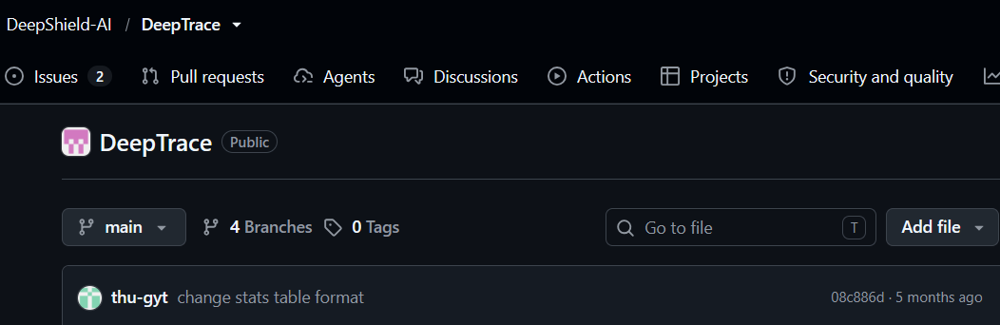

# Project summary

This document is the central overview of the PoC: what was attempted, what
worked, and what conclusions can be drawn about distributed tracing approaches.

## Goal

The project evaluates whether modern methods of analysing distributed
applications through distributed traces are stable and practical enough to
apply in a controlled benchmark environment.

The benchmark application is DeathStarBench Social Network. The PoC explores
instrumentation-based tracing (Jaeger) alongside newer approaches that aim to
reduce or eliminate application instrumentation (DeepFlow, DeepTrace).

Related context on zero-instrumentation tracing research:
[ACM DL](https://dl.acm.org/doi/10.1145/3718958.3750477).

## Environment

- **Benchmark:** DeathStarBench Social Network (Docker Compose)
- **Load generator:** wrk2
- **Benchmark points:** four workloads defined in [baseline-methodology.md](baseline-methodology.md)
- **Completed baseline:** Jaeger all-in-one 1.62.0 (built into the DeathStarBench stack)

## Evaluation path

```text
Goal: evaluate distributed tracing methods
  │
  ├─ DeepFlow (first choice)     → not integrated (Docker / K8s conflict)
  │
  ├─ DeepTrace (second choice)   → not integrated (immature tooling)
  │
  └─ Jaeger (baseline)           → completed (wrk2 + traces + analysis)
```

## Approaches evaluated

### DeepFlow (first choice)

DeepFlow was the initial candidate because it offers eBPF-based,
network-level observability without per-service instrumentation — a natural
complement to Jaeger's instrumented spans.

**Why it was not integrated**

The official DeepFlow documentation
([All-in-One Quick Deployment — Deploy Using Docker Compose](https://deepflow.io/docs/ce-install/all-in-one/))
states that Docker is **not recommended** for deploying the DeepFlow server:

- The server relies on the Kubernetes lease mechanism for leader election and
  high availability across replicas. Docker lacks this mechanism, forcing
  single-replica operation.
- In single-replica mode, the bundled ClickHouse can only run as a single
  shard, leading to uneven writes and slower queries under load.

DeathStarBench in this PoC runs entirely on **Docker Compose**. There is no
Kubernetes cluster available. Integrating DeepFlow would require a separate K8s
deployment (or replacing the Compose-based setup), which is outside the scope
of this PoC.


**Outcome:** DeepFlow was not deployed; no traces were collected.

### DeepTrace (second choice)

After the DeepFlow infrastructure mismatch, DeepTrace was selected as a
research-oriented alternative for zero-instrumentation distributed tracing.

A detailed step-by-step log of the attempt is in
[trying_out_deeptrace.md](trying_out_deeptrace.md).

**Summary of issues encountered**

- Documentation did not match the actual implementation (missing scripts,
  incorrect CLI behaviour, undocumented configuration fields).
- Agent installation and runtime required local patches to upstream code.
- Configuration sync failed (`user_id` vs `user_name`, SSH connectivity).
- Span correlation and trace assembly produced no usable traces despite
  generating workload traffic.

Representative screenshots from the attempt:




The DeepTrace repository also appears inactive; a successor project (Zerotrace)
exists but was not evaluated in this PoC.

**Outcome:** DeepTrace was not integrated; no traces were collected.

### Jaeger (completed baseline)

Jaeger is already instrumented in DeathStarBench Social Network and runs
alongside the application stack without additional infrastructure.

**What was delivered**

- wrk2 results for all four benchmark points (`experiments/results/baseline-jaeger/`)
- Three manually exported traces per point (shortest, median, longest)
- Per-workload analysis in [docs/traces/](traces/)
- Cross-workload synthesis in [jaeger-findings.md](jaeger-findings.md)

**Outcome:** Jaeger is stable in this environment and produced the only
complete dataset in the PoC.

## Retrospective comparison

| Dimension | Jaeger | DeepFlow | DeepTrace |
| --- | --- | --- | --- |
| Integrated in PoC | yes | no | no |
| Reason | native to DSB stack | Docker/K8s infrastructure conflict | immature / undocumented tooling |
| Infrastructure | Docker Compose (same as DSB) | K8s recommended for server | separate server + agent stack |
| Instrumentation | per-service spans | eBPF / network-level (not tested) | zero-instrumentation (not tested) |
| Traces collected | 12 JSON + written analysis | none | none |
| Service visibility | full call graph in UI | not evaluated | not evaluated |
| Latency attribution | per-span durations | not evaluated | not evaluated |
| Operational overhead | already present in DSB | agent + separate server deploy | agent + server + Elasticsearch |

## Conclusions

1. **Jaeger (instrumentation-based tracing) is production-ready** in this
   setup. It exposes service topology, per-span latency, and request paths
   reliably across all four benchmark points.

2. **DeepFlow is not practical in a Docker Compose-only environment.** The
   project's own documentation discourages Docker deployment for the server
   side. A fair evaluation would require Kubernetes infrastructure that this
   PoC did not provide.

3. **DeepTrace is not ready for use.** The implementation appears unfinished,
   documentation is unreliable, and no traces could be collected after
   extensive troubleshooting.

4. **New tracing methods did not prove stable or applicable** within the
   constraints of this PoC. The research question — whether emerging
   zero-instrumentation approaches can replace or complement classical tracing
   — remains open, but neither alternative tested here delivered usable data.

5. **Jaeger has known limitations** even when it works well. Aggregate wrk2
   latency under load (seconds) diverges sharply from individual trace
   durations (milliseconds). Queueing and contention visible in load-test
   metrics are not fully explained by inspecting a handful of hand-picked
   traces. See [jaeger-findings.md](jaeger-findings.md) for details.

## Documentation map

| Document | Content |
| --- | --- |
| [baseline-methodology.md](baseline-methodology.md) | Jaeger benchmark methodology |
| [jaeger-findings.md](jaeger-findings.md) | Cross-workload Jaeger synthesis and links to per-workload trace docs |
| [docs/traces/](traces/) | Per-workload wrk2 + trace analysis |
| [trying_out_deeptrace.md](trying_out_deeptrace.md) | Detailed DeepTrace attempt log |
