# DeepTrace evaluation log

Detailed record of the DeepTrace integration attempt. For the overall PoC
context — including why DeepTrace was chosen after DeepFlow could not be
deployed — see [project-summary.md](project-summary.md).

## Outcome

DeepTrace was **not integrated**. No distributed traces were collected despite
deploying the server, installing the agent, generating workload traffic, and
attempting span correlation and trace assembly.

The primary blocker was a persistent gap between the
[DeepTrace documentation](https://deepshield-ai.github.io/DeepTrace/introduction.html)
and the actual implementation. The tooling appeared unfinished and required
local patches to upstream code.

## Legend

Throughout this log:

- **Documented step** — action taken directly from official documentation
- **Issue** — problem encountered during the step
- **Resolution** — attempted fix (successful or not)
- **Unresolved** — blocker that prevented collecting usable traces

The screenshots below are evidence from a manual integration attempt. They
document what was observed during troubleshooting; they are not an automated,
repeatable test transcript.

## Attempt timeline

1. Deploy DeepTrace server.
2. Deploy SocialNetwork workload.
3. Install and run DeepTrace agent.
4. Generate traffic with wrk2.
5. Attempt span correlation and trace assembly.
6. Stop after unresolved trace collection failures.

## 1. Deploying DeepTrace server

**Documented step:** Clone the DeepTrace GitHub repository.

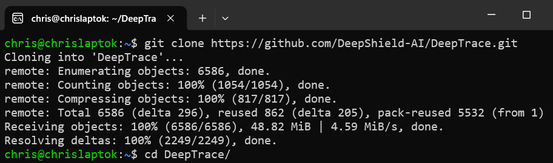

**Documented step:** Fill in `server/config/config.toml`.

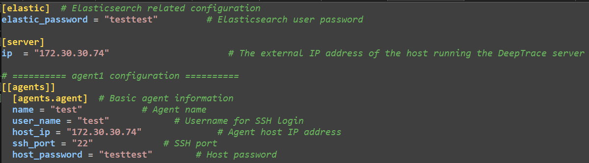

**Documented step:** Deploy the server with `scripts/deploy_server.sh` and
confirm it is running.

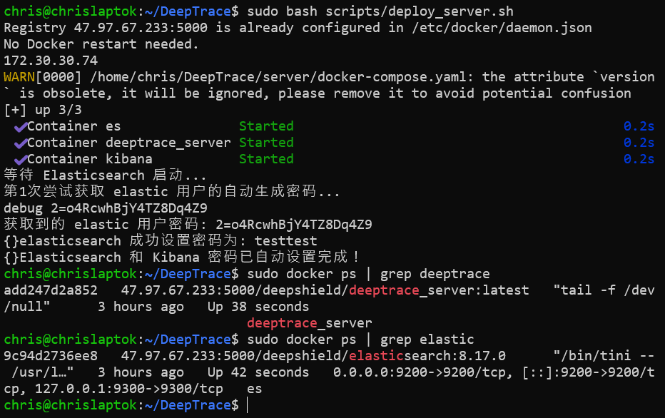

## 2. Deploying SocialNetwork application

**Documented step:** Use the `deploy.sh` script in
`tests/workload/socialnetwork` to deploy the application.

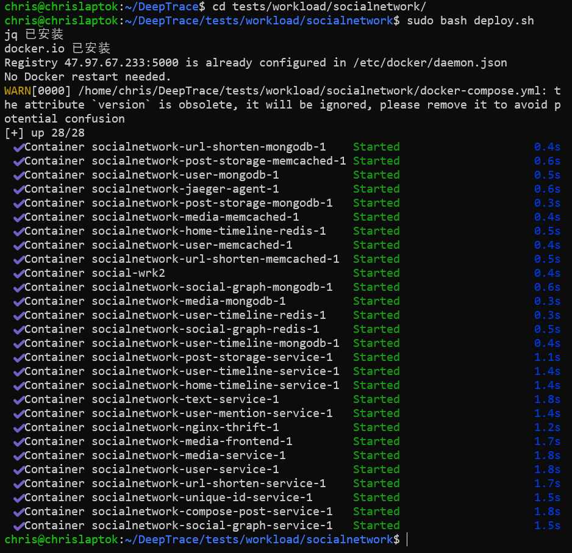
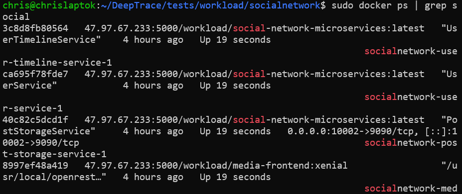

**Issue:** The built-in data injection script referenced in the documentation
was not found.

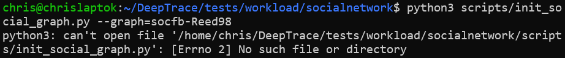

**Resolution (successful):** Deploy SocialNetwork from the DeathStarBench
submodule instead.

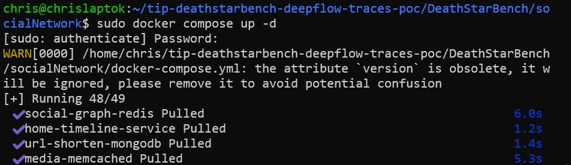
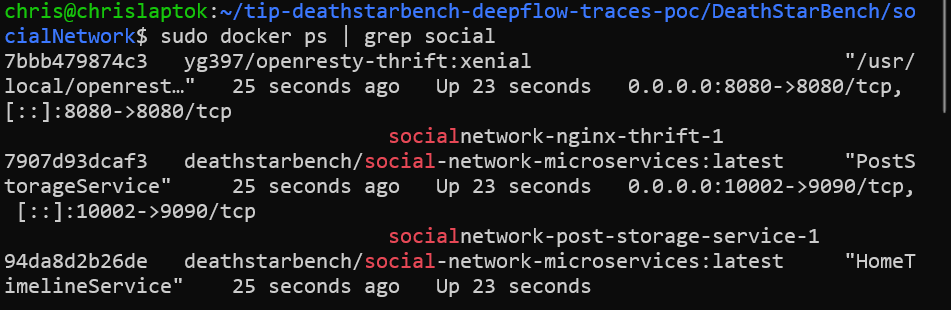

**Documented step:** Inject data into the application.

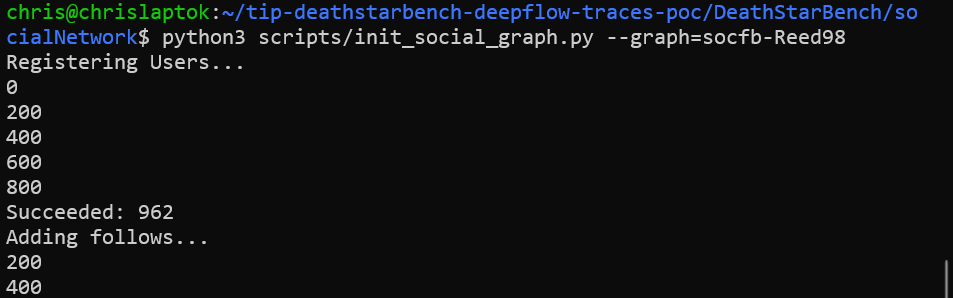

## 3. Installing DeepTrace agent

**Issue:** The documented `agent install` command exited immediately. The
implementation suggested a progress bar would be shown.

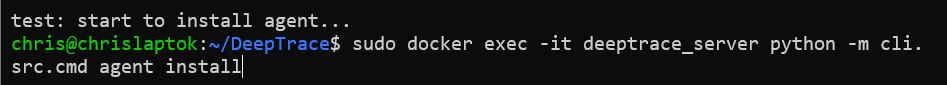

**Resolution (successful):** Use the underlying install script from the
`agent install` implementation, which downloaded dependencies and built the
agent from source.

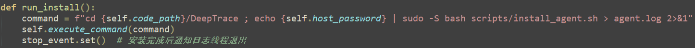

## 4. Running DeepTrace agent

**Issue:** Running the agent produced an error in `server/controller/src/agent.py`.

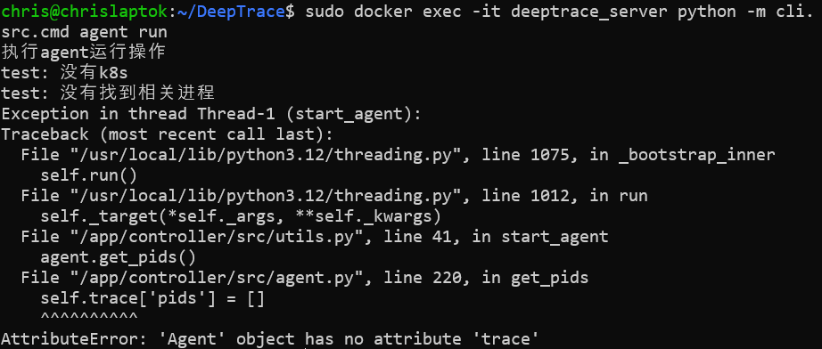

**Resolution (successful):** Patch `server/controller/src/agent.py`.

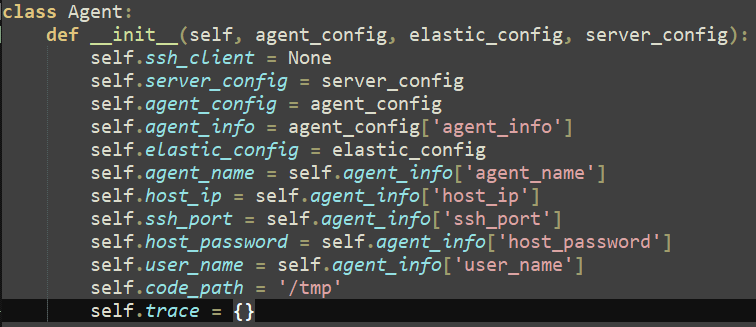

**Issue:** Next run failed with a `user_id` configuration error. The
documentation did not mention this field.

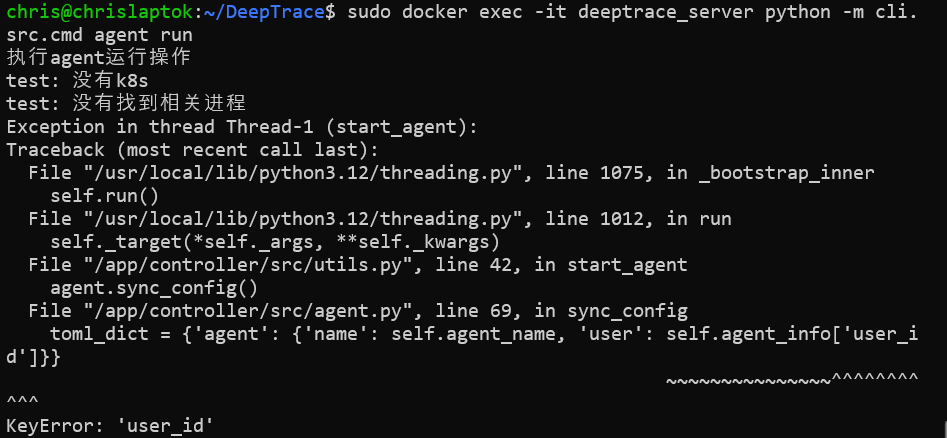

**Resolution (unsuccessful):** Add `user_id` to `config.toml`.

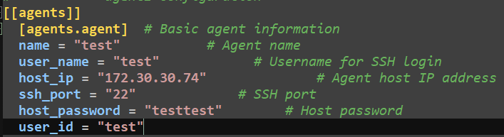

Modified `sync_config` to inspect agent state:

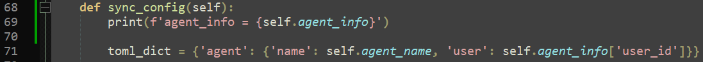

The agent ignored the `user_id` entry:

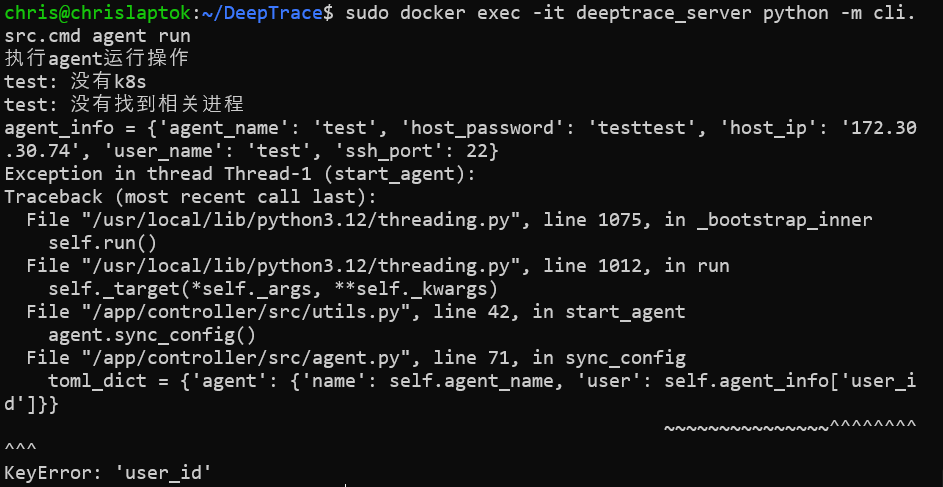

**Resolution (successful):** Map `user_name` to `user_id` in the implementation.

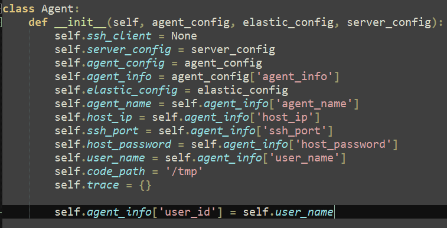

**Issue:** Agent could not synchronize its configuration file.

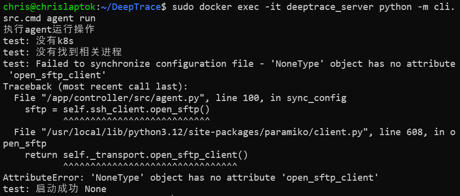

**Resolution (successful):** Patch the `connect` function with additional checks.

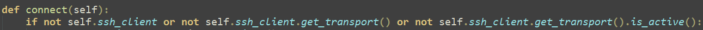

**Issue:** Agent could not connect to the server via SSH. The server had SSH
disabled.

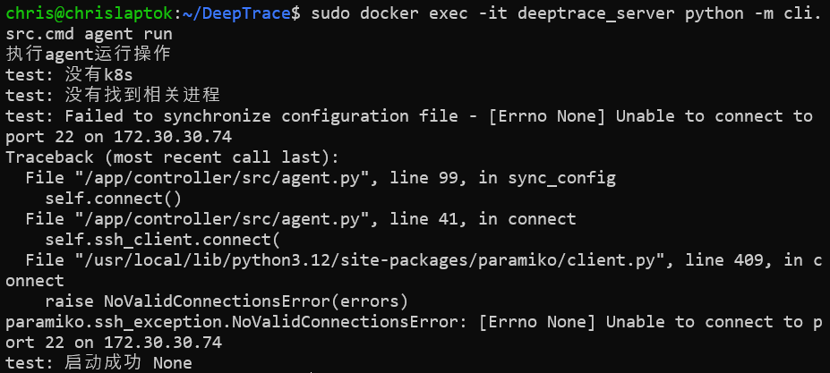

Manually obtained a SocialNetwork process PID:

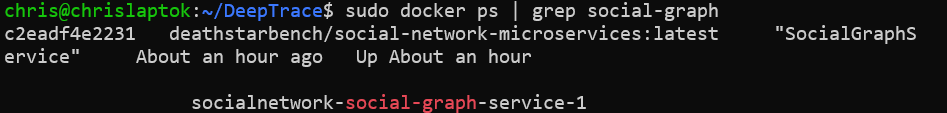
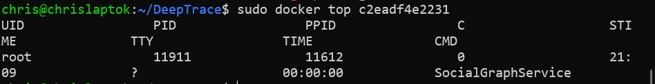

**Resolution (successful):** Manually synchronize `agent/config/deeptrace.toml`.

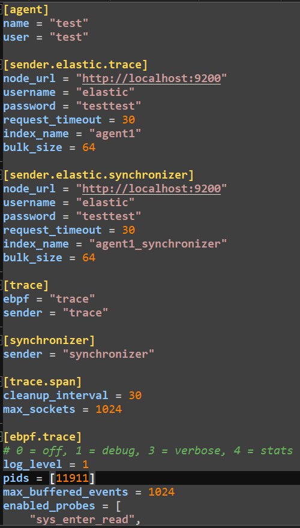

Confirmed Elasticsearch API availability at `localhost:9200` with config
credentials before the next agent run:

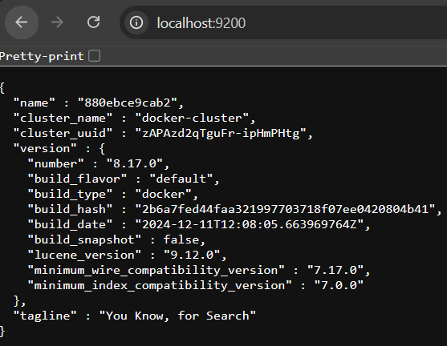

**Resolution (successful):** Abandon the broken `agent run` command and invoke
the underlying script directly.

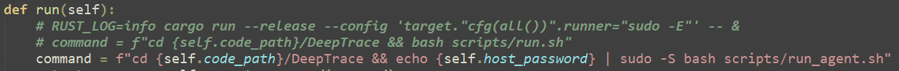
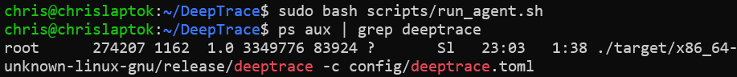

## 5. Generating traffic

**Documented step:** Generate traffic using `run_wrk2_baseline.sh`.

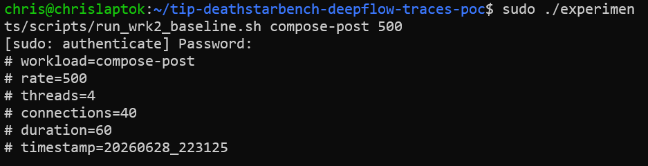

## 6. Obtaining traces

**Issue:** Span correlation failed initially.

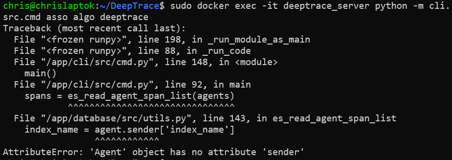

**Resolution (successful):** Copy agent configuration to `config.toml`.

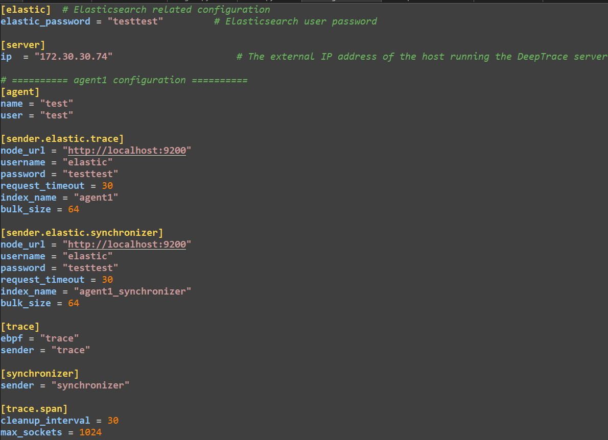

**Issue (unresolved):** Span correlation returned no traces. Re-running after
additional traffic generation produced the same empty result.

**Issue (unresolved):** Trace assembly failed with an error.

Further attempts to fix DeepTrace did not yield usable traces.

## Conclusions

| Area | Assessment |
| --- | --- |
| Documentation accuracy | Poor — missing scripts, undocumented config fields, CLI behaviour differs from docs |
| Agent stability | Required multiple local patches to upstream code |
| Trace collection | Failed — no traces collected after correlation or assembly |
| Production readiness | Not ready — implementation appears unfinished |

DeepTrace in its current form is not suitable for production use or for
reproducible research evaluation without significant engineering effort on
unmaintained code.

## Repository status

The DeepTrace GitHub repository shows no recent activity and appears abandoned.

A successor project called Zerotrace exists and shows active development. This
observation is noted for context only; Zerotrace was not evaluated in this PoC.

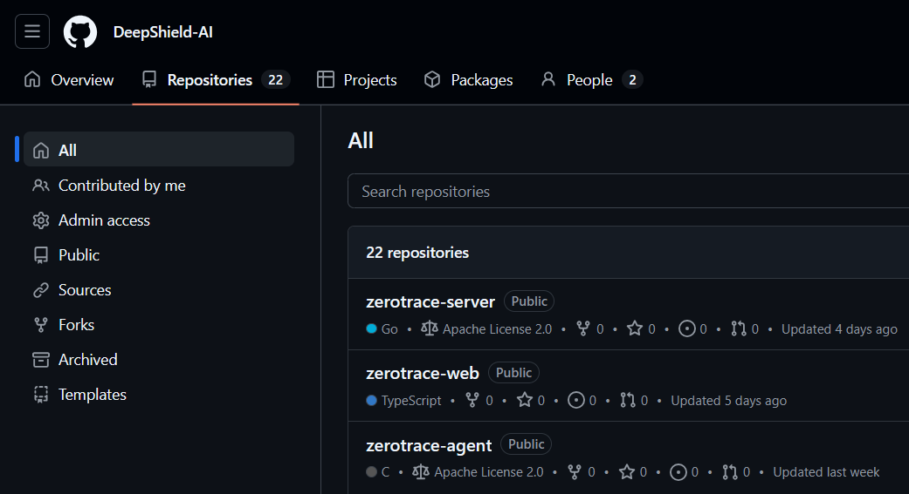
